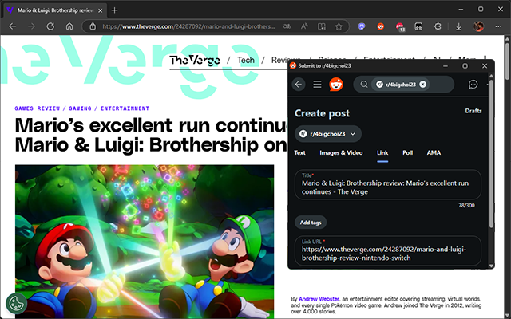

# Share to Reddit

Share to Reddit is a browser extension for quickly sharing links and tabs to the Reddit. You can click the Reddit button in the top bar (or the keyboard shortcut) to share the current tab, or right-click a link on any page. You can also select text and select Reddit community in the context (right-click) menu to share a snippet.

The browser extension can store multiple communities options, and synchronize them with your browser's settings. It uses the share dialog hosted by Reddit, so no API access or account permissions are required.

---

This project is inspired by [corbindavenport/share-to-mastodon](https://github.com/corbindavenport/share-to-mastodon)
